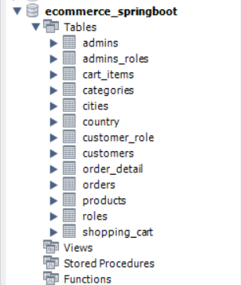

# E-Commerce Website for Turkish Products

This project is an e-commerce website primarily focusing on Turkish products. It includes an admin panel, a client panel, and a library that connects everything. The project is being developed for my father, ensuring robust validation and secure operations.

## Table of Contents

1. [Introduction](#introduction)
2. [Features](#features)
3. [Technologies Used](#technologies-used)
4. [Installation](#installation)
5. [Usage](#usage)
6. [Screenshots](#screenshots)
7. [Contributing](#contributing)
8. [License](#license)
9. [Contact](#contact)

## Introduction

This e-commerce platform allows users to browse, search, and purchase various Turkish products. Administrators can manage products, orders, and users through a dedicated admin panel.

## Features

- User Authentication (Registration, Login, Logout)
- Product Listing and Details
- Shopping Cart and Checkout
- Order Management
- Admin Panel for Product and Order Management
- CRUD operations for products, orders, and users
- Database integration with proper validation and checks
- Responsive design with Thymeleaf templates

## Technologies Used

- **Backend:** Java, Spring Boot
- **Frontend:** HTML, CSS, JavaScript, Thymeleaf
- **Database:** MySQL (or any other database you use)
- **Libraries:** Lombok
- **Tools:** Maven, Git

## Installation

1. Clone the repository:
   ```bash
   git clone https://github.com/yourusername/e-commerce-website.git

2. Navigate to the project directory:
   ```bash
   cd e-commerce-website

3. Install dependencies:
   ```bash
   mvn install
4. Configure the database settings in application.properties.
5. Run the application:
   ```bash
   mvn spring-boot:run

## Usage
1. Access the website at http://localhost:8019/admin/ for Admin Panel and http://localhost:8020/shop/ for Customer Panel.
2. Log in as an admin to manage products, orders, and users. 
3. Register or log in as a user to browse and purchase products.

## Screenshots


- *Login for Admin, you can create and log.*


- *This is admin homepage.*


- *You can add/delete Categories.*


- *You can add/delete Products.*


- *You can see and apply/finish Orders.*


- *Login for every Customer, you can create and log.*


- *This is customer homepage.*


- *Menu, you can see overall products with categories.*


- *This is Real Shop, you can every product with categories, search by name product, sort by categories and see how much products has every category.*


- *When you add some products, your chart will have products and you can order.*


- *When you click "Продължи", you will see last Panel for eventually customizing customer's information, and if you continue, you will finish the order.*


- *Finished? You see your receipt for products.*


- *Once you finish your order, you can see in "Вашите поръчки"  yours orders. When is added and when will be shipped, you can cancel the order.*


- *Contacts, when you have problem or want to visit us, contacts about us.*


- *More information about us and location with Google Map.*


- *Every table for this project in base data(This is from MySQL, i think you can use DBeaver for example too).*


- ***WARNING**: Please in **country** and **cities** add some information, because the order can't be finished, if it is empty. For example in **country** add country_id 
 is id number of country and name the country next to it. In **cities**, just add id number city, name and exist country_id number. After screenshots, i will explain better how to Setup the Data Base*

## Database Setup
**WARNING**: Please ensure that you have populated the country and cities tables with some initial data, otherwise the order cannot be completed. Here are the steps to add the necessary information:

*Adding Data to the Country Table*
1. Open your database management tool (e.g., MySQL Workbench).
2. Execute the following SQL query to insert data into the country table:
   ```sql
   INSERT INTO country (country_id, name) VALUES (1, 'Turkey');
- country_id is the ID number of the country.
- name is the name of the country.

*Adding Data to the Cities Table*
1. Execute the following SQL query to insert data into the cities table:
   ```sql
   INSERT INTO cities (city_id, name, country_id) VALUES (1, 'Istanbul', 1);
- city_id is the ID number of the city.
- name is the name of the city.
- country_id is the ID number of the corresponding country, creating a link between the city and the country.

## Contributing
If you wish to contribute to this project, please fork the repository and submit a pull request. You can also open an issue to discuss potential improvements or report bugs.

1. Fork the repository
2. Create a new branch (git checkout -b feature-branch)
3. Commit your changes (git commit -m 'Add some feature')
4. Push to the branch (git push origin feature-branch)
5. Open a pull request
   
## License
This project is not licensed.

## Contact
For any questions or comments, feel free to reach out:

- Name: Martin Kostadinov
- Email: marti.kostadinov2003@gmail.com
- instagram: https://www.instagram.com/marti.kostadinov7777
- Linkedin: https://www.linkedin.com/in/marti-kostadinov-954483243
- Facebook: https://www.facebook.com/profile.php?id=100081383798329
